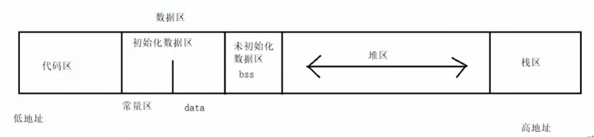

# Day11 到学校了  
### 一、局部变量和全局变量  
**局部变量（栈区，未初始化时为乱码）**：在函数内部定义的变量  使用auto修饰：auto int a=0；//关键字**auto**并不常用，经常省略  
**局部变量的生命周期**：从创建到函数结束  
**全局变量（数据区，未初始化时为0）**：在函数外部定义的变量  
**全局变量的生命周期**：从程序创建到程序销毁//数据在操作时，会使用就近原则  
**全局变量的作用域**：整个项目中的所有文件，在其他文件中使用时，需要提前声明：extern int a;  
1. 匿名内部函数：{ 函数内容 } //在匿名函数中重新定义一个变量，则不改变外面相同命名的变量  
### 二、静态变量  
**静态局部变量（数据区，未初始化时为0）**：只能在本函数中使用,只会初始化一次，可以多次赋值，从程序创建到程序销毁  
**静态全局变量（数据区，未初始化时为0）**：只能在本文件中使用，不可以在项目其他文件中使用了，从程序创建到程序销毁  
### 三、全局函数和静态函数  函数可以调用自己，成为递归函数，但一定要有出口  
**静态函数（代码区）**：静态函数只能用在本文件中，从程序创建到程序销毁  
**全局函数（代码区）**：全局函数可以用在项目中所有文件中  
静态函数可以和全局函数重名，但是在本文件中优先使用静态函数
### 四、内存模型  
1. 代码区：程序执行的二进制码（程序指令），调用时，使用指针调用。  
1.1 共享  
1.2 可读  
2. 数据区：2.1 初始化数据区（data） 2.2 未初始化数据区（bss） 2.3 常量区  
3. 栈区（先进后出，后进先出）：系统为每一个程序分配一个临时的空间（局部变量/函数信息/函数参数/数组），栈区的大小为1M，入栈数据，先从高地址向低地址存；出栈数据，从低地址向高地址读  
3.1 在windows中可以扩展到10M，3.2 在Linux中可以扩展到16M  
4. 堆区：存储大数据（图片/音乐/视频），需要手动开辟和手动释放  
4.1 手动开辟：malloc 4.2 手动释放：free  
  
### 五、堆空间开辟和释放  
**开辟**：malloc(空间大小) 一般写作：malloc(sizeof(int)*数据大小)//sizeof(int)是4字节   
**返回类型**：一个void*类型，因此可以用int * p=malloc(),返回的是一个地址  
**使用**：*p = 123  
**释放**：free(p)  
**归p为NULL**：p=NULL //否则会变成野指针  
> int* p=malloc(sizeof(int)*820000);  
> if(p==NULL)//或if(!p)  
> {  
>   printf("ERROR");  
>   return -1;  
> }